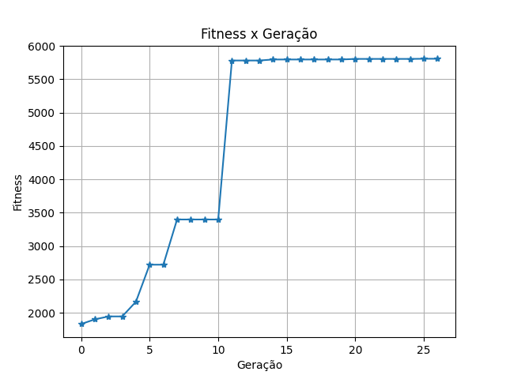

# Super Smartio World

Este projeto foi desenvolvido como projeto final da disciplina "Inteligência Artificial" ministrada pelo Prof. Dr. Fabrício Olivetti de França, no primeiro quadrimestre de 2020 (2020.1) na Universidade Federal do ABC (UFABC).

<br>

## **Considerações iniciais**

1) Este projeto foi desenvolvido em Python utilizando a versão 3.8.5 e, portanto, recomenda-se **fortemente** a utilização desta. Apesar disso, são suportadas as versões 3.8.X (**NÃO** há suporte para as versões > 3.9.0). 

2) Todas as bibliotecas externas utilizadas com suas respectivas versões, podem ser encontradas no arquivo "requirements.txt". Para instalá-las, insira em seu terminal:
````
pip install -r requirements.txt
````

3) Para a execução deste projeto, é **necessário** possuir a rom do jogo Super Mario World de SNES. Tendo o arquivo "rom.sfc" em mãos, é necessário move-lo para: 
```` 
./lib/pythonX/site-packages/retro/data/stable/SuperMarioWorld-Snes/
````
Onde X em "pythonX" representa a sua versão (em nosso caso é 3.8 e, portanto, usaremos "python3.8").

4) Agradeço ao Prof. Dr. Fabrício Olivetti de França pela autorização no uso dos módulos [rominfo.py](https://github.com/azzolinovarella/super-smartio-world/blob/master/fornecidos_pelo_professor/rominfo.py) e [utils.py](https://github.com/azzolinovarella/super-smartio-world/blob/master/fornecidos_pelo_professor/utils.py), escritos e disponibilizados por ele (folivetti@ufabc.edu).
<br><br>


## **Explicação geral**
Para executar quaisquer um dos quatro módulos ([train.py](https://github.com/azzolinovarella/super-smartio-world#m%C3%B3dulo-trainpy), [play.py](https://github.com/azzolinovarella/super-smartio-world#m%C3%B3dulo-playpy), [plot_evolution.py](https://github.com/azzolinovarella/super-smartio-world#m%C3%B3dulo-plot_evolutionpy), ou [generate_video.py](https://github.com/azzolinovarella/super-smartio-world#m%C3%B3dulo-generate_videopy)) há no mínimo duas opções possíveis:
1) Executar para os individuos treinados pelo aluno:
````
python -m NOME_DO_MODULO
````

2) Executar para os indivíduos que serão treinados pelo usuário (população obtida após o uso de: ````python -m train new````  -  explicado com mais detalhes nos tópicos abaixo):
````
python -m NOME_DO_MODULO new
````
Onde "NOME_DO_MODULO" pode assumir os valores de [train](https://github.com/azzolinovarella/super-smartio-world#m%C3%B3dulo-trainpy), [play](https://github.com/azzolinovarella/super-smartio-world#m%C3%B3dulo-playpy), [plot_evolution](https://github.com/azzolinovarella/super-smartio-world#m%C3%B3dulo-plot_evolutionpy), ou [generate_video](https://github.com/azzolinovarella/super-smartio-world#m%C3%B3dulo-generate_videopy)
<br><br>


## **Explicação detalhada do projeto**

A partir do uso da biblioteca externa [NEAT-Python](https://neat-python.readthedocs.io/), buscou-se fazer uso do algoritmo conhecido por NEAT (*NeuroEvolution of Augmenting Topologies*) para criar o um agente inteligente capaz de jogar a fase *YoshiIsland2* do jogo *Super Mario World*. Esse algoritmo parte do conceito conhecido por Neuroevolução, buscando evoluir redes neurais artificiais utilizando algoritmos genéticos até encontramos a topologia desejada (i.e., em nosso caso é aquela que capacita  um agente a terminar a fase *YoshiIsland2*).

Para este projeto foi necessário criar um [arquivo de configuração](https://github.com/azzolinovarella/super-smartio-world/blob/master/config.txt) (exigido pela biblioteca [NEAT-Python](https://neat-python.readthedocs.io/)), responsável por indicar os argumentos utilizados pelo algoritmo. Ressalta-se que alguns parâmetros receberam valores default (encontrados na [documentação da biblioteca](https://neat-python.readthedocs.io/en/latest/config_file.html)) enquanto outros como a quantidade de neurônios nas camadas de entrada, saída e ocultas ("num_inputs", "num_outputs" e "num_hidden" respectivamente), função de ativação ("activation_default"), tamanho da população ("pop_size"), quantidades de indivíduos preservados por geração ("elitism"), porcentagem de individuos que irão se reproduzir ("survival_threshold") e etc., foram modificados por tentativa e erro e baseando-se em literaturas (contidas nas [referências](https://github.com/azzolinovarella/super-smartio-world#refer%C3%AAncias)).

Por fim, destaca-se que esse projeto foi dividido em 4 módulos: [train.py](https://github.com/azzolinovarella/super-smartio-world#m%C3%B3dulo-trainpy), [play.py](https://github.com/azzolinovarella/super-smartio-world#m%C3%B3dulo-playpy), [plot_evolution.py](https://github.com/azzolinovarella/super-smartio-world#m%C3%B3dulo-plot_evolutionpy) e [generate_video.py](https://github.com/azzolinovarella/super-smartio-world#m%C3%B3dulo-generate_videopy) que, simplificadamente, são utilizados para treinar nossos agentes, utilizar um conjunto de indivíduos já treinados para jogarem a fase selecionada, validar a evolução de forma gráfica e gerar um vídeo do melhor agente até o momento jogando uma fase selecionada (respectivamente). Abaixo encontram-se explicações mais detalhadas sobre cada módulo. 
<br><br>


### *Módulo [train.py](https://github.com/azzolinovarella/super-smartio-world/blob/master/train.py)*
Este módulo tem como objetivo treinar os agentes salvando sempre o melhor.

#### <u>Instruções de execução</u>:
Há duas opções para a execução deste módulo: 

1) Executar o treinamento a partir da útlima população treinada pelo aluno (salvas em "checkpoints"):
````
python -m train
````

2) Executar o treinamento para uma nova população. Caso não haja nenhum checkpoint salvo em "ng-checkpoints", uma nova população será treinada; caso já tenha ocorrido algum treinamento, uma mensagem no terminal será exibida perguntando se o usuário deseja retomar o treinamento ou iniciar um novo (apagando todos os arquivos ali salvos). Note, portanto, que essa opção **não** altera o treinamento já feito pelo aluno (checkpoints são salvos em diretórios diferentes):
````
python -m train new
````
Em ambos os casos, quando executamos esse módulo informações sobre a geração, ID do indivíduo, coordenada final, penalidade total, fitness, o tempo gasto no jogo e um boolean indicando se é o melhor indivíduo, serão impressos na tela (escritos pelo autor) bem como estatísticas sobre cada população (geradas pela própria biblioteca NEAT-Python) ao final da verificação de todos os indivíduos.
<br>

#### <u>Explicação das funções</u>:
É dividido em duas funções: 
* **eval_genomes**: Cria uma RNA para cada indivíduo da população e valida o quão bom ele é por meio da atribuição de um "Fitness" que, para aqueles indivíduos que não **terminaram** a fase, é a maior distância em x que um Mario alcança, descontada de uma penalização dada toda vez que o agente enfrenta um inimigo cara a cara, enquanto para aqueles que **terminaram** a fase, a posição final acrescida de uma função de tempo  (essa taxa é usada para dar preferência aos mais rápidos, i.e., aqueles que terminaram a fase mais rápido). Este valor é utilizado tanto para selecionar os 2 melhores individuos que serão mantidos para a próxima geração, quanto os 30% melhores (15 indivíduos) que serão responsáveis por gerarem a próxima população. Além disso, está função é reponsável por verificar se algum indivíduo naquela população é o melhor encontrado até o momento; se for, salva este individuo em um arquivo do tipo ".plk" para que possa ser usado posteriormente (e.g. no módulo [play](https://github.com/azzolinovarella/super-smartio-world#m%C3%B3dulo-playpy)).

* **main**: É a função principal do nosso arquivo, chamada logo que nosso módulo é executado. Essa função é utilizada para determinar se é desejado retomar o treinamento a partir da última população (caso não tenha sido inserido nada junto ao comando de execução), criar uma nova população do zero nos casos em que foi selecionada essa situação ou retomar o treinamento da nova população (os dois ultimos casos são selecionados quando inserimos "new" junto ao comando de execução do módulo, i.e., ````python -m train new````) para, finalmente, chamar a função "eval_genomes".
<br><br>


### *Módulo [play.py](https://github.com/azzolinovarella/super-smartio-world/blob/master/play.py)*
Este módulo tem como objetivo fazer com que um conjunto de indivíduos joguem a fase desejada.

#### <u>Instruções de execução</u>:
Há três opções para a execução deste módulo: 

1) Fazer com que o melhor agente treinado pelo aluno (presente em "./checkpoints/best_genome.pkl") jogue a fase selecionada:
````
python -m play
````

2) Fazer com que o melhor agente treinado da nova população (treinado por meio de ````python -m train new```` e presente em "./ng-checkpoints/ng-best_genome.pkl") jogue a fase selecionada:
````
python -m play new
````

3) Fazer com que todos os indivíduos de uma população contida em "./checkpoints" ou "./ng-checkpoints" joguem a fase selecionada:
````
python -m play NOME_DO_ARQUIVO_CHECKPOINT
````
Onde NOME_DO_ARQUIVO_CHECKPOINT pode assumir:
* "neat-checkpoint-x" onde x é o número do checkpoint salvo (e.g. "neat-checkpoint-1", "neat-checkpoint-30")
* "ng-neat-checkpoint-x" onde x é o número do checkpoint salvo da **nova geração** (treinada a partir de ````python -m train new````)

Note que a fase selecionada é, por padrão, "YoshiIsland2", fase em que o agente foi treinado.
<br>

#### <u>Explicação das funções</u>:
É dividido em duas funções:
* **play_game**: Cria uma RNA a partir do arquivo fornecido e, então, executa o jogo até que todos os agentes alcancem algum critério de parada (i.e., fiquem presos, morram ou terminem a fase). Além de exibir a tela do jogo, gera a cada iteração uma matriz 13x13 representando a visão do Mário no jogo, onde o bloco central de cor <span style="color:magenta">magenta</span> representa o <span style="color:magenta">Mario</span>, os <span style="color:green">verdes</span> representam os <span style="color:green">inimigos</span>, os <span style="color:blue">azuis</span> representam os <span style="color:blue">blocos físicos</span> (onde é possível pisar) enquanto os <u>vazados</u> representam a <u>ausência de bloco</u>. Por fim, similar ao módulo [train](https://github.com/azzolinovarella/super-smartio-world#m%C3%B3dulo-trainpy), exibe os resultados obtidos pelo melhor agente. 
* **main**: É a função principal do nosso arquivo, chamada logo que nosso módulo é executado. Essa função é utilizada, basicamente, para configurar o ambiente, verificar se é desejado utilizar a população treinada pelo aluno, a nova ou algum checkpoint e executar a função "play_game" para a opção selecionada.
<br><br>


### *Módulo [plot_evolution.py](https://github.com/azzolinovarella/super-smartio-world/blob/master/plot_evolution.py)*
Este módulo tem como objetivo plotar o fitness máximo por geração para verificar graficamente a neuroevolução.

#### <u>Instruções de execução</u>:
Há duas opções para a execução deste módulo: 

1) Plotar os fitness máximos das populações geradas pelo aluno (presentes em "./checkpoints" com prefixo "neat-checkpoint-"):
````
python -m plot_evolution
````

2) Plotar os fitness máximos das populações geradas a partir de ````python -m train new```` (presentes em "./ng-checkpoints" com prefixo "ng-neat-checkpoint-"):
````
python -m plot_evolution new
````
<!-- Aparentemente não é necessário pular uma linha aqui-->

#### <u>Explicação das funções</u>:
É dividido em duas funções:
* **generate_graph**: Gera um gráfico de Fitness x Geração a partir do conjunto de populações fornecidas em um diretório e o salva em formato ".png" nesta mesma pasta.
* **main**: É a função principal do nosso arquivo, chamada logo que nosso módulo é executado. Essa função é utilizada, basicamente, para verificar se é desejado utilizar a população treinada pelo aluno ou a nova e, então, chamar a função "generate_graph".

Abaixo encontra-se o último gráfico gerado:<br><br>


<br>  <!-- Coloquei só um porque aqui no VSCode o gráfico já da um espação --> 


### *Módulo [generate_video.py](https://github.com/azzolinovarella/super-smartio-world/blob/master/generate_video.py)*
Este módulo tem como objetivo gerar um vídeo ".mp4" para o melhor agente treinado até o momento jogando uma determinado fase. 

#### <u>Instruções de execução</u>:
Há duas opções para a execução deste módulo: 

1) Gerar o vídeo do melhor agente treinado pelo aluno (presente em "./checkpoints/best_genome.pkl") jogando determianda fase (por padrão é a "YoshiIsland2", fase em que o agente foi treinado):
````
python -m generate_video
````

2) Gerar o vídeo do melhor agente treinado pela nova população (treinado a partir de ````python -m train new```` e presente em "./ng-checkpoints/ng-best_genome.pkl") jogando determina fase (por padrão é a "YoshiIsland2", fase em que o agente será treinado):
````
python -m generate_video new
````
<!-- Aparentemente não é necessário pular uma linha aqui-->

#### <u>Explicação das funções</u>:
É dividido em duas funções:
* **mk_video**: Cria o vídeo do melhor agente jogando a fase selecionada e o salva no diretório em que o agente está salvo. 
* **main**: É a função principal do nosso arquivo, chamada logo que nosso módulo é executado. Essa função é utilizada, basicamente, para verificar se é desejado utilizar o melhor agente treinado pelo aluno ou aquele que será encontrado no treinamento da nova população e, então, chamar a função "mk_video".

<br><br>

## **Referências**:

[1] Neat-python.readthedocs.io. 2021. Welcome to NEAT-Python’s documentation! — NEAT-Python 0.92 documentation. [online] Disponível em: <<https://neat-python.readthedocs.io/>> [Accessado 04 Abril 2021].

[2] sentdex, 2021. The NEAT Algorithm is Neat. [video] Disponível em: <<https://youtu.be/ZC0gMhYhwW0>> [Accessado 04 Abril 2021].

[3] Thompson, L., 2018. Sonic AI Bot Using Open-AI and NEAT Tutorial. [video] Disponível em: <<https://www.youtube.com/playlist?list=PLTWFMbPFsvz3CeozHfeuJIXWAJMkPtAdS>> Feito por L. Thompson. [Acessado 04 de Abril de 2021]

[4] O. Stanley, K. and Miikkulainen, R., 2002. Efficient Evolution of Neural Network Topologies. [PDF] Disponível em: <<http://nn.cs.utexas.edu/downloads/papers/stanley.cec02.pdf>> [Accessado 04 Abril 2021].

[5] Medium. 2021. A simple way to save videos from OpenAI Retro. [online] Disponível em: <<https://medium.com/@andreiliphd/a-simple-way-to-save-videos-from-openai-retro-1cfd7bbd463>> [Accessado 04 Abril 2021].

[6] SethBling, 2015. MarI/O - Machine Learning for Video Games. [video] Disponível em: <<https://www.youtube.com/watch?v=qv6UVOQ0F44>> [Acessado 15 Abril 2021].
